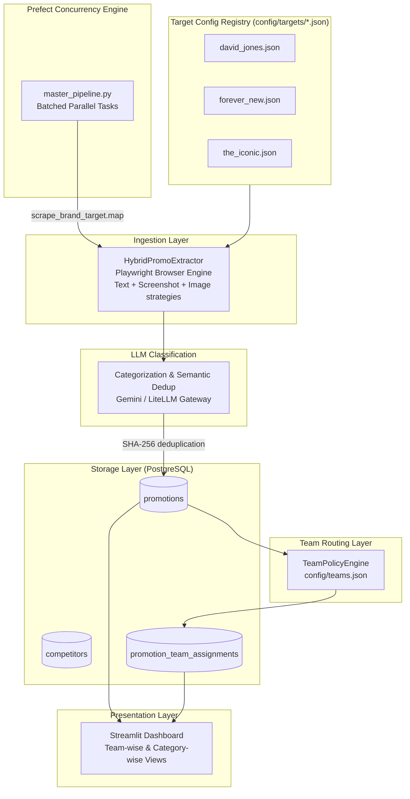
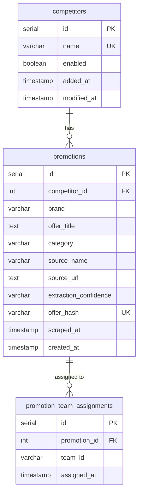

# Retail Competitive Intelligence Scraper — Architecture & Implementation

---

## 1. Executive Summary

The Retail Competitive Intelligence Scraper is a production-grade, end-to-end competitive promotion tracker. It continuously monitors competitor websites (such as **David Jones**, **Forever New**, **The Iconic**, and **Sephora**) in parallel using a hybrid scraper. It extracts text and visual promotional banners, classifies them into business categories via LLM, routes them to team feeds via a configurable policy engine, applies URL-aware deduplication, and stores clean promotion rows in PostgreSQL for dashboard review.

---

## 2. System Architecture

The platform consists of four layers: ingestion, storage, routing, and presentation.



---

## 3. Data Ingestion & Extraction Strategy

### 3.1 Target Configuration File Structure
Each site has a standalone, declarative configuration file inside `config/targets/` defining elements to target:
- `brand`: Brand string representation.
- `source_url`: URL of the promotion/sale landing page. Can be a single string URL, a list of URL strings, or a list of `{"url": "...", "category_hint": "..."}` objects for per-page LLM category context.
- `enabled`: Optional boolean (`true` | `false`) to temporarily enable or disable the scraper target. Defaults to `true` if not specified.
- `extraction_strategy`: One of `"text"`, `"screenshot"`, `"image"`, or `"hybrid"` (text + screenshot combined).
- `text_selectors`: CSS selectors targeting banners, headers, and promo blocks for text extraction.
- `screenshot_selectors`: CSS selectors targeting elements containing visual offers (processed by Vision LLM).
- `banner_selectors`: CSS selectors for `` src URL collection (image strategy only).
- `request_delay_seconds`: Delay between Vision API calls (default 4).
- `scroll_depth`: Scroll iterations to trigger lazy loading (default 3).
- `category`: Top-level fallback category. If the LLM assigns "Others" but this field is set (e.g. `"Beauty"`), the system overrides the LLM's choice. Ensures brand-specific targets always produce the correct category.
- `category_hint`: Per-URL or top-level string injected into the LLM categorization prompt as a strong prior. Guides the model to prefer this category for ambiguous offers (e.g. `"Cosmetics and skincare -> Beauty. Always Beauty."`).
- `promo_keywords_pattern`: Optional custom regex for promotional text filtering. Overrides the default broad pattern when set.

### 3.2 In-Browser JavaScript Element Extraction
To prevent rate limiting and handle hidden mobile banners or responsive designs (which fail standard screenshotting), the scraper uses Playwright to evaluate DOM elements. For hidden images, a browser-side fetch fetches image bytes directly using the browser's credentials to bypass CDN/CORS protections. All strategies use stealth browser settings (custom user-agent, `sec-ch-ua` headers, WebDriver property removal) to bypass Cloudflare/Akamai bot detection.

### 3.3 LLM Category Classification & Semantic Deduplication
After extraction, all offers for a brand are sent to the LLM in a single batched call for:
1. **Filtering** — removes non-promotional items (loyalty programs, newsletter signups, shipping notices).
2. **Semantic deduplication** — groups offers referring to the same campaign and selects a clean canonical title.
3. **Categorization** — assigns each offer to one of the categories defined in the `PROMO_CATEGORIES` environment variable.
4. **Category fallback override** — if the LLM assigns "Others" but the target config declares a top-level `category` field, the system overrides the LLM's choice. This ensures brands like Bobbi Brown (cosmetics) always categorize as "Beauty" rather than falling through to "Others".

### 3.4 SHA-256 Deduplication
Before writing promotions to the database, a unique SHA-256 fingerprint is calculated:
```python
offer_hash = SHA256(source_name + brand + source_url + offer_title + scraped_date)
```
If the database already contains a record with the same `offer_hash`, the scraper updates the `scraped_at` timestamp. Otherwise, it inserts a new promotion row. The date component ensures the same offer is re-recorded daily for timeline tracking.

---

## 4. Team Routing

Business team routing is controlled by `config/teams.json` and is applied after promotions are stored.

1. Each promotion has an LLM-assigned `category` and a `brand`.
2. `TeamPolicyEngine` evaluates each promotion against team rules: category matching, allowed brands, excluded brands.
3. Matching team IDs are written to the `promotion_team_assignments` junction table.
4. A promotion can belong to multiple teams.

Re-apply routing without re-scraping:
```bash
python scripts/reassign_teams.py
```

---

## 5. Database Schema

Managed via SQLAlchemy, the database uses three tables:

### 5.1 ER Diagram



### 5.2 Table Reference

- **`competitors`**: Registry of retail competitor brands. Created automatically on first scrape if missing.
- **`promotions`**: Core promotions table containing extracted offers, LLM-assigned category, denormalized brand name, source URL, extraction confidence, and timestamps.
- **`promotion_team_assignments`**: Junction table recording which business teams should see each promotion. Managed by `TeamPolicyEngine`.

---

## 6. Environment Variables

| Variable | Description | Default |
|---|---|---|
| `DATABASE_URL` | PostgreSQL connection string | *(required)* |
| `LLM_PROVIDER` | LLM routing: `litellm` (gateway) or `gemini` (direct) | `gemini` |
| `LITELLM_API_BASE` | LiteLLM gateway URL (enables LiteLLM mode) | *(unset = direct Gemini)* |
| `LITELLM_API_KEY` | API key for LiteLLM gateway | — |
| `VISION_LLM_MODEL` | Model name for vision/text LLM calls | `gemini/gemini-2.5-flash` |
| `GEMINI_API_KEY` | Direct Gemini API key (when not using LiteLLM) | — |
| `PROMO_CATEGORIES` | Comma-separated category taxonomy for LLM classifier | *(required)* |
| `MAX_CONCURRENT_BROWSERS` | Max parallel Playwright browsers in Prefect flow | `4` |
| `VISION_API_MIN_DELAY` | Minimum seconds between API dispatches | `4.5` |
| `VISION_COST_PER_MILLION_TOKENS_USD` | Cost estimate rate for API tracking | `1.00` |
| `DASHBOARD_LOOKBACK_DAYS` | Rolling window for dashboard queries (days) | `90` |

---

## 7. Operations & Runbook

### Standalone Sequence Run
```bash
python scripts/run_hybrid_promo_scraper.py
```

### Single Target Run
```bash
python scripts/run_hybrid_promo_scraper.py --target config/targets/the_iconic.json
```

### Mapped Concurrency Run (Prefect)
```bash
python flows/master_pipeline.py
```

The master pipeline generates a structured summary report containing:
- **Per-brand results table** — success/error status, offers extracted, stored, and cost per brand
- **Aggregate stats** — total brands, offers, stored count, cost, and success rate
- **Failed Sites table** — brands that encountered errors during extraction
- **Zero Offers table** — brands that completed successfully but extracted no promotional offers

### Database Initialization
To create tables on a fresh setup:
```bash
python scripts/init_db.py
```

### Database Clean Up
To wipe and reset promotions and competitor tables:
```bash
python scripts/reset_db.py
```

### Re-apply Team Routing
After editing `config/teams.json`, re-assign all existing promotions:
```bash
python scripts/reassign_teams.py
```

### Launch the Dashboard
To start the Streamlit web dashboard to filter and view promotions:
```bash
streamlit run dashboard/app.py
```
