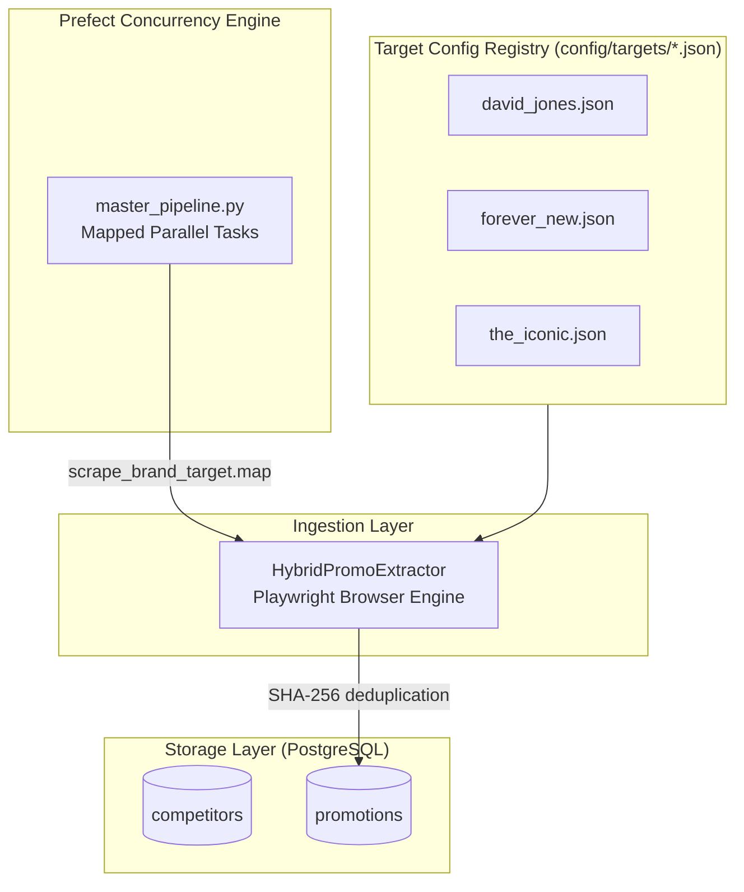
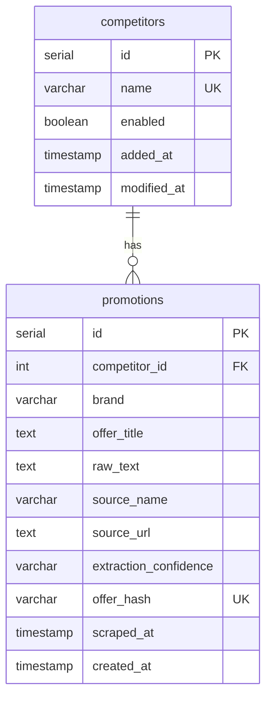

# Retail Competitive Intelligence Scraper — Architecture & Implementation

---

## 1. Executive Summary

The Retail Competitive Intelligence Scraper is a production-grade, end-to-end competitive promotion tracker. It continuously monitors competitor websites (such as **David Jones**, **Forever New**, and **The Iconic**) in parallel using a hybrid scraper. It extracts text and visual promotional banners, applies deduplication, and stores them in a streamlined PostgreSQL database.

---

## 2. System Architecture

The platform consists of a simplified raw ingestion layer and an enriched relational storage layer:



---

## 3. Data Ingestion & Extraction Strategy

### 3.1 Target Configuration File Structure
Each site has a standalone, declarative configuration file inside `config/targets/` defining elements to target:
- `brand`: Brand string representation.
- `source_url`: URL of the promotion/sale landing page.
- `extraction_strategy`: Hybrid parsing combining text and visual elements.
- `text_selectors`: CSS selectors targeting banners, headers, and promo blocks.
- `screenshot_selectors`: CSS selectors targeting elements containing visual offers (processed by Vision LLM).

### 3.2 In-Browser JavaScript Element Extraction
To prevent rate limiting and handle hidden mobile banners or responsive designs (which fail standard screenshotting), the scraper uses Playwright to evaluate DOM elements. For hidden images, a browser-side fetch fetches image bytes directly using the browser's credentials to bypass CDN/CORS protections.

### 3.3 SHA-256 Deduplication
Before writing promotions to the database, a unique SHA-256 fingerprint is calculated:
```python
offer_hash = SHA256(source_name + competitor.name + offer_title)
```
If the database already contains a record with the same `offer_hash`, the scraper simply updates the `scraped_at` timestamp. Otherwise, it inserts a new promotion row.

---

## 4. Database Schema

Managed via SQLAlchemy, the database uses two tables:

### 4.1 ER Diagram



### 4.2 Table Reference

- **`competitors`**: Registries of retail competitor brands. Created automatically on first scrape if missing.
- **`promotions`**: Core promotions table containing extracted raw offers, denormalized brand name (`brand`), source name, page URLs, and timestamps.

---

## 5. Operations & Runbook

### Standalone Sequence Run
```bash
python scripts/run_hybrid_promo_scraper.py
```

### Mapped Concurrency Run (Prefect)
```bash
python flows/master_pipeline.py
```

### Database Initialization
To create tables on a fresh setup:
```bash
python scripts/init_db.py
```

### Database Clean Up
To wipe and reset promotions and competitor tables:
```bash
python scripts/reset_db.py
```

