## Implementation Plan v3 — Full Technical Specification

> **Purpose:** End-to-end implementation guide for building an AI agent that autonomously visits a competitor website, analyses its structure, generates a working scraper, validates it, and registers it into the existing scraping platform — with minimal human intervention.
>
> **Audience:** Engineering leads, product managers, and developers building on top of the existing hybrid scraping infrastructure.
>
> **Status:** Planned — V1 target: ~4 weeks from kickoff.
>
> **Changelog from v2:** This revision grounds the plan against the actual `myers_competitive_analysis` codebase. Key changes: (1) LLM provider corrected from Claude/Anthropic to existing LiteLLM/Groq + Gemini infrastructure, (2) `scraping_sources` references replaced with actual `competitors` table, (3) `extraction_type` values aligned to real `HybridPromoExtractor` strategies, (4) file paths corrected (`dashboard/app.py`, not `app.py`), (5) RBAC simplified to single-role for solo operator, (6) Repair Agent deferred to fast-follow, (7) calibration script deferred, (8) confidence score contradiction fixed, (9) Appendix A content inlined, (10) `sandbox_entrypoint` concretely specified, (11) audit log table DDL added. Changes marked **[v3]** inline.

---

## 1. Executive Summary

Today, adding a new competitor to the scraping platform requires:

```
Engineer manually:
  1. Visits the site and analyses its structure          (~2 hours)
  2. Identifies CSS selectors or image patterns          (~2 hours)
  3. Writes the config JSON                              (~1 hour)
  4. Tests the scraper                                   (~2 hours)
  5. Registers it in the platform                        (~1 hour)

Total: 1–2 engineering days per competitor
```

This agent reduces that to:

```
Engineer provides:
  1. Target URL
  2. Business rules (what to extract)
  3. Review and approval of generated output             (~15 minutes)

Agent handles everything else.
Target: 80% of sites automated end-to-end.
```

---

## 2. System Overview

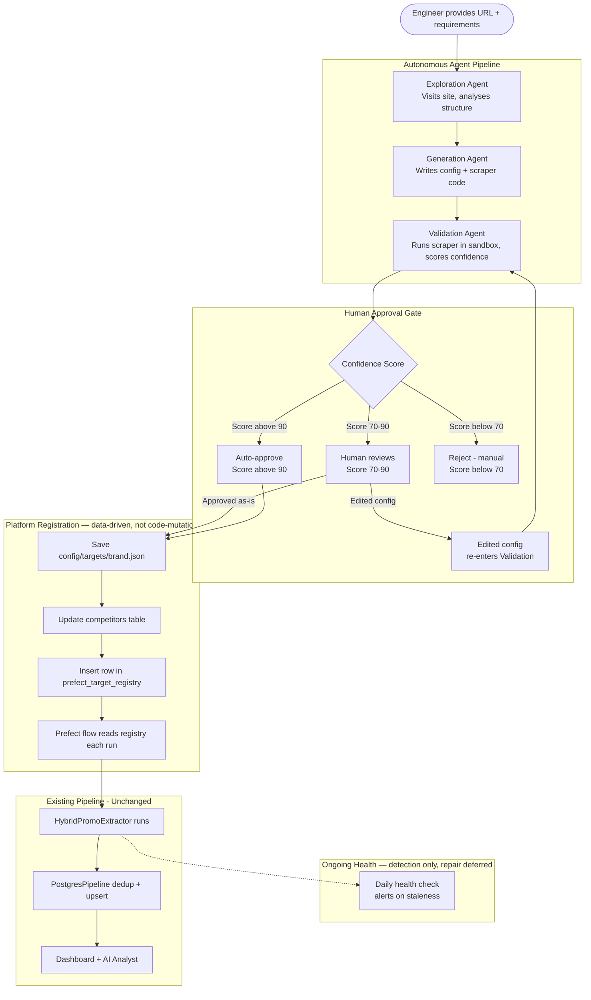

---

## 3. Technology Stack

| Layer | Technology | Purpose |
| --- | --- | --- |
| Browser Automation | Playwright (Python, async) | Opens target sites, executes JS, captures DOM and screenshots |
| Vision Analysis | Gemini 2.0 Flash (via `google-genai` SDK, already in repo) | Analyses screenshots to identify promotional content visually |
| Agent Reasoning | **LiteLLM / Groq (existing `llm/factory.py`) with Gemini fallback [v3]** | Analyses site structure, writes config JSON, generates scraper code |
| Agent Orchestration | LangGraph | Manages multi-step agent workflow with state, retries, and branching |
| **Sandboxed Execution [v2]** | **Docker (rootless, per-run container)** | **Runs generated scraper code with no ambient network/filesystem access beyond an explicit allowlist** |
| Validation Runner | Pydantic + sandboxed subprocess (see §9a) | Validates output schema inside the sandbox above |
| Approval Interface | Streamlit (new tab in `dashboard/app.py` **[v3]**) | Human review UI - shows site analysis, generated config, sample output |
| Config Storage | JSON files in config/targets/ | One file per competitor - existing pattern |
| Platform DB | PostgreSQL (existing) | **`competitors` table [v3]** + **`prefect_target_registry` table [v2]** |
| Scheduling | Prefect (existing) | **Reads active targets from DB registry at flow-run time — no source file edits [v2]** |
| Secrets | python-dotenv (existing) | GEMINI_API_KEY, GROQ_API_KEY, LITELLM_API_KEY / LITELLM_API_BASE |
| **Outcome Logging [v2]** | **New table: `agent_run_outcomes`** | **Tracks confidence score vs. real-world scraper health for future calibration** |

### New Dependencies

```
# Add to requirements.txt
langgraph              # Agent workflow orchestration
langchain-groq         # Already present (used by llm/factory.py)
docker                 # [v2] Python Docker SDK — for sandboxed execution
```

> **Note [v3]:** `anthropic` is NOT needed. The agent reasoning layer uses the existing LiteLLM/Groq infrastructure exposed through `llm/factory.py`, with Gemini as a fallback. `google-genai` and `playwright` are already in `requirements.txt`. `streamlit` is already present.

---

## 4. Architecture — Three Agents (Repair Agent Deferred) [v3]

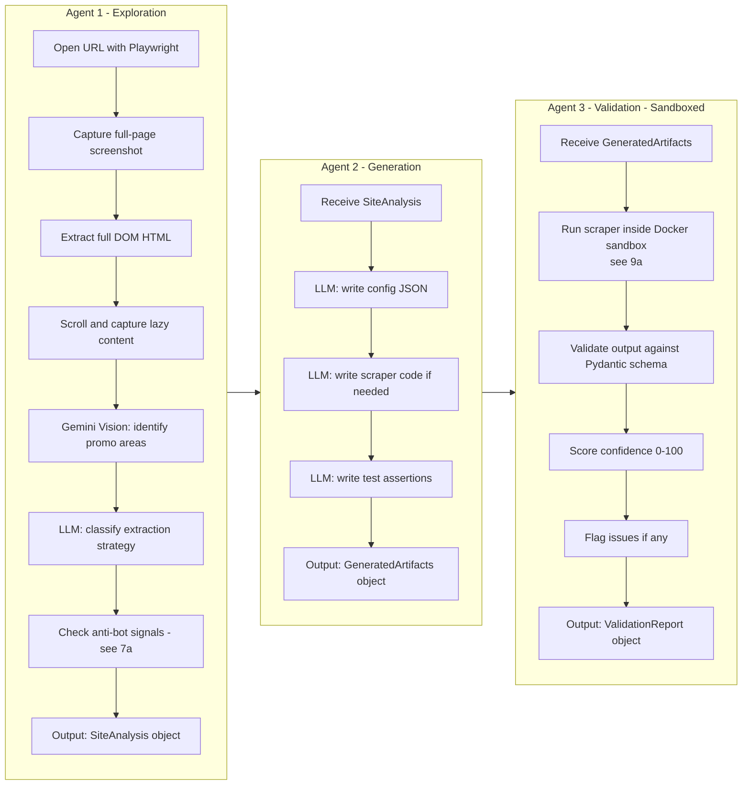

> **[v3] Repair Agent deferred.** The Repair Agent (automated selector re-generation on staleness) is deferred to a fast-follow after 2+ weeks of production data. The health check (detection + alerting) ships in this version. See §19a.

---

## 5. Project Structure

```
myers_competitive_analysis/
│
├── agent/                                 ← NEW: all agent code
│   ├── __init__.py
│   ├── orchestrator.py                    ← LangGraph workflow definition
│   ├── exploration_agent.py               ← Agent 1: site analysis
│   ├── generation_agent.py                ← Agent 2: config + code generation
│   ├── validation_agent.py                ← Agent 3: sandboxed run + validate + score
│   ├── sandbox_runner.py                  ← NEW [v2]: Docker container lifecycle
│   ├── sandbox_entrypoint.py              ← NEW [v3]: runs inside Docker container
│   ├── models.py                          ← Pydantic models for agent state
│   └── prompts.py                         ← All LLM prompts
│
├── scripts/
│   ├── run_hybrid_promo_scraper.py        ← existing
│   ├── run_scraper_agent.py               ← NEW: CLI entry point for agent
│   ├── run_health_check.py                ← NEW [v2]: daily staleness detection
│   ├── init_db.py                         ← existing
│   └── reset_db.py                        ← existing
│
├── config/
│   └── targets/
│       ├── david_jones.json               ← existing
│       ├── the_iconic.json                ← existing
│       ├── ... (13 existing configs)
│       └── [agent generates new files here]
│
├── database/
│   ├── models.py                          ← ADD: new columns to Competitor,
│   │                                        new PrefectTargetRegistry model [v2],
│   │                                        new AgentRunOutcome model [v2],
│   │                                        new AgentAuditLog model [v3]
│   └── connection.py                      ← unchanged
│
├── llm/                                   ← existing, unchanged
│   ├── factory.py                         ← LiteLLM/Groq with fallback + LangChain wrappers
│   ├── groq_client.py
│   ├── litellm_client.py
│   └── base.py
│
├── promo_scraper/
│   └── hybrid_promo_extractor.py          ← unchanged
│
├── flows/
│   └── master_pipeline.py                 ← UPDATE: read from prefect_target_registry
│
├── dashboard/
│   ├── app.py                             ← existing Streamlit — add Agent tab [v3]
│   └── utils/
│       ├── db.py                          ← existing
│       ├── styles.py                      ← existing
│       └── exporter.py                    ← existing
│
├── docker/                                ← NEW [v2]: sandbox infrastructure
│   ├── Dockerfile.sandbox                 ← minimal Python image for sandbox
│   └── setup_egress_network.sh            ← creates scraper-egress-only Docker network
│
├── alembic/                               ← existing migration framework
│   └── versions/                          ← existing migrations + new ones
│
├── docs/
│   └── implementation_plan.md             ← this file [v3]
│
└── requirements.txt
```

---

## 6. Data Models — Agent State

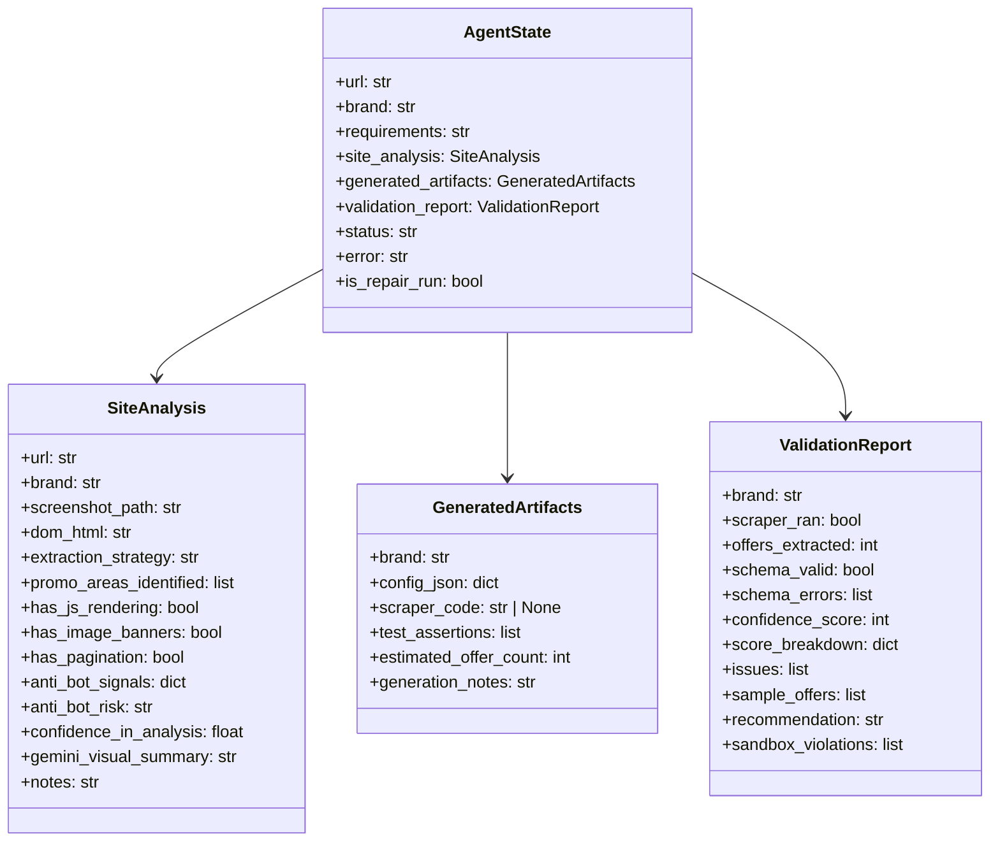

> **Changes from v2 [v3]:**
> - `SiteAnalysis.extraction_type` renamed to `extraction_strategy` with valid values: `"text"`, `"screenshot"`, `"image"`, `"hybrid"` — matching `HybridPromoExtractor`'s actual `extraction_strategy` field.
> - `GeneratedArtifacts.scraper_code` is explicitly `str | None` — `None` means the site can be handled by `HybridPromoExtractor` with config alone (see §9a sandbox_entrypoint for how this case is handled).
> - `AgentState.triggered_by` removed — was unused. `is_repair_run` is sufficient.

---

## 7. Agent 1 — Exploration Agent

### Responsibility

Visit the target website, understand its structure, and produce a `SiteAnalysis` object.

### 7a. Anti-Bot Signal Detection — concrete checklist [v2]

```python
# agent/exploration_agent.py

ANTI_BOT_CHECKS = {
    "cloudflare_challenge": lambda resp, dom: (
        "Just a moment" in dom or resp.headers.get("cf-mitigated") == "challenge"
    ),
    "captcha_present": lambda resp, dom: any(
        marker in dom.lower() for marker in ["recaptcha", "hcaptcha", "turnstile"]
    ),
    "blocked_status_code": lambda resp, dom: resp.status in (403, 429, 503),
    "suspiciously_short_dom": lambda resp, dom: len(dom) < 2000,
    "bot_detection_script": lambda resp, dom: any(
        marker in dom for marker in ["datadome", "perimeterx", "akamai-bot"]
    ),
}

def score_anti_bot_risk(resp, dom: str) -> tuple[str, dict]:
    triggered = {name: check(resp, dom) for name, check in ANTI_BOT_CHECKS.items()}
    hits = sum(triggered.values())
    if hits >= 2:
        risk = "high"
    elif hits == 1:
        risk = "medium"
    else:
        risk = "low"
    return risk, triggered   # triggered dict is stored on SiteAnalysis.anti_bot_signals
```

`anti_bot_signals` (the raw dict of which checks fired) is now stored on `SiteAnalysis` and surfaced in the human review UI — a reviewer can see *why* a site was flagged medium/high risk instead of trusting an opaque label.

### Workflow

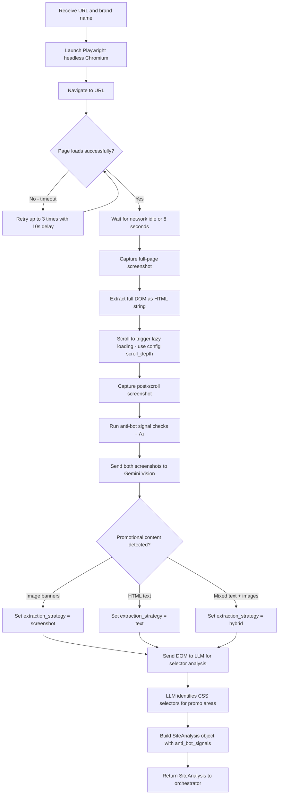

> **Changes from v2 [v3]:**
> - `extraction_type` → `extraction_strategy` with values matching `HybridPromoExtractor`: `text`, `screenshot`, `image`, `hybrid`.
> - Removed `js_text` (not a real strategy). Sites with JS-rendered text use `screenshot` strategy.
> - "Claude" → "LLM" — agent uses LiteLLM/Groq via `llm/factory.py`, not Claude directly.

### Gemini Vision Prompt — `EXPLORATION_VISUAL_PROMPT`

```python
# agent/prompts.py

EXPLORATION_VISUAL_PROMPT = """You are analyzing a retail website screenshot to identify promotional content.

Look at this screenshot and identify:
1. All visible promotional banners, sale announcements, and discount offers
2. Whether the promotions are text-based (HTML elements) or image-based (banner images)
3. The approximate number of distinct promotional offers visible
4. Any promotional categories visible (e.g., "Women's Fashion", "Shoes", "Home")

For each promotional area you find, describe:
- Its approximate location on the page (top banner, mid-page tile, footer strip, etc.)
- Whether it appears to be an HTML text element or an image/banner
- The promotional text visible (e.g., "Up to 50% off", "Buy 2 Get 1 Free")
- The product category if identifiable

Respond in JSON format:
{
    "promotional_areas": [
        {
            "location": "top banner",
            "type": "image" | "text",
            "promo_text": "Up to 50% off selected styles",
            "category": "Women's Fashion",
            "confidence": "high" | "medium" | "low"
        }
    ],
    "total_promo_areas_found": 3,
    "dominant_promo_type": "image" | "text" | "mixed",
    "summary": "Brief description of the promotional content layout"
}"""
```

### DOM Analysis Prompt — `DOM_ANALYSIS_PROMPT`

```python
# agent/prompts.py

DOM_ANALYSIS_PROMPT = """You are analyzing the DOM HTML of a retail website to identify CSS selectors for promotional content.

Given the following DOM HTML and a visual analysis summary, identify the most reliable CSS selectors that target promotional banners, sale announcements, and discount text.

Visual analysis summary: {visual_summary}

DOM HTML (truncated to relevant sections):
{dom_html}

For each type of promotional content, provide CSS selectors that will work with
querySelector/querySelectorAll. Prefer:
- Class-based selectors over tag-based
- Partial attribute matches ([class*='promo']) for resilience to minor class name changes
- Multiple fallback selectors per area

The target scraper (HybridPromoExtractor) uses two types of selectors:
1. `text_selectors`: CSS selectors whose `.textContent` contains promotional text
2. `screenshot_selectors`: CSS selectors for elements to screenshot and send to Vision API

Respond in JSON format:
{
    "extraction_strategy": "text" | "screenshot" | "hybrid",
    "text_selectors": ["selector1", "selector2"],
    "screenshot_selectors": ["selector1", "selector2"],
    "notes": "Explanation of selector choices and any concerns"
}"""
```

---

## 8. Agent 2 — Generation Agent

### Responsibility

Receive a `SiteAnalysis` and produce a `GeneratedArtifacts` object containing a config JSON matching the exact shape `HybridPromoExtractor` expects, optional custom scraper code, and test assertions.

### Config JSON Shape — Must Match HybridPromoExtractor [v3]

The generated config must conform to the interface consumed by `HybridPromoExtractor.__init__()`:

```json
{
    "brand": "Example Brand",
    "source_url": "https://www.example.com/sale",
    "spider": "image_promo",
    "extraction_strategy": "hybrid",
    "text_selectors": [
        "[class*='PromoBanner']",
        "[class*='sale'] h1"
    ],
    "screenshot_selectors": [
        "[class*='HeroBanner']",
        "[class*='PromoTile']"
    ],
    "min_image_width": 400,
    "min_image_height": 150,
    "min_aspect_ratio": 1.2,
    "request_delay_seconds": 4,
    "scroll_depth": 2,
    "enabled": true
}
```

**Required fields:** `brand` (str), `source_url` (str or list)
**Optional but recommended:** `extraction_strategy`, `text_selectors`, `screenshot_selectors`, `min_image_width`, `min_image_height`, `min_aspect_ratio`, `request_delay_seconds`, `scroll_depth`, `enabled`

> **Note [v3]:** `source_url` can be a single string, a list of strings, or a list of `{"url": "...", "category": "..."}` objects — all three forms are supported by the extractor.

### Config Generation Prompt — `CONFIG_GENERATION_PROMPT`

```python
# agent/prompts.py

CONFIG_GENERATION_PROMPT = """You are generating a scraper configuration JSON for a retail website.

Based on the site analysis below, produce a JSON config that HybridPromoExtractor can consume directly.

Site Analysis:
- URL: {url}
- Brand: {brand}
- Extraction Strategy: {extraction_strategy}
- Visual Summary: {visual_summary}
- Identified Promo Areas: {promo_areas}
- CSS Selectors Found: {selectors}
- Anti-Bot Risk: {anti_bot_risk}
- Notes: {notes}

Requirements from the user: {requirements}

The config JSON MUST have this exact shape:
{{
    "brand": "{brand}",
    "source_url": "{url}",
    "spider": "image_promo",
    "extraction_strategy": "{extraction_strategy}",
    "text_selectors": [...],
    "screenshot_selectors": [...],
    "min_image_width": 400,
    "min_image_height": 150,
    "min_aspect_ratio": 1.2,
    "request_delay_seconds": 4,
    "scroll_depth": 2,
    "enabled": true
}}

Rules:
- extraction_strategy must be one of: "text", "screenshot", "image", "hybrid"
- text_selectors: CSS selectors whose textContent contains promo text
- screenshot_selectors: CSS selectors for elements to capture as screenshots for Vision API
- Use [class*='partial'] selectors for resilience to class name changes
- Provide at least 3 text_selectors and 3 screenshot_selectors
- Set request_delay_seconds to 4 (default) unless the site is known to rate-limit aggressively
- Set scroll_depth based on whether lazy-loaded content was detected

Also provide:
1. An estimated offer count (how many offers you expect the scraper to find)
2. Any notes about extraction risks or edge cases

Respond with ONLY valid JSON — no markdown fences, no commentary outside the JSON."""
```

### Workflow

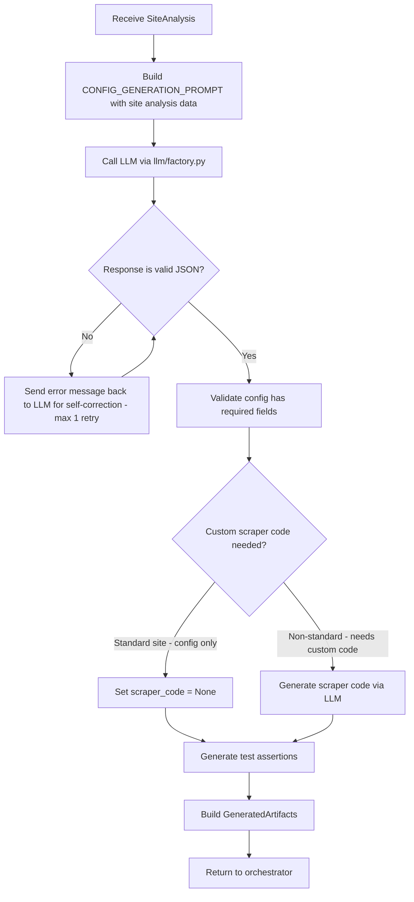

---

## 9. Agent 3 — Validation Agent

### 9a. Sandboxed Execution — replaces the bare subprocess timeout [v2]

**v1 problem:** the generated scraper ran in a plain subprocess with only a 60-second timeout. That controls runtime, not behavior — the code could still write files, reach arbitrary network hosts, or consume unbounded memory before the timeout fires.

**v2 fix:** every validation run executes inside a locked-down, single-use Docker container:

```python
# agent/sandbox_runner.py

import docker

SANDBOX_IMAGE = "promo-scraper-sandbox:latest"   # minimal Python image, no shell utilities beyond what's needed

def run_scraper_in_sandbox(scraper_code: str | None, config: dict, timeout_seconds: int = 60) -> dict:
    client = docker.from_env()

    env_vars = {"CONFIG_JSON": json.dumps(config)}
    if scraper_code:
        env_vars["SCRAPER_CODE_B64"] = base64.b64encode(scraper_code.encode()).decode()

    container = client.containers.run(
        SANDBOX_IMAGE,
        command=["python", "-m", "sandbox_entrypoint"],
        detach=True,
        network_mode="scraper-egress-only",   # pre-created Docker network: allows outbound
                                               # HTTPS to the target domain only, nothing else
        mem_limit="512m",
        nano_cpus=1_000_000_000,               # 1 CPU
        pids_limit=64,
        read_only=True,                        # root filesystem is read-only
        tmpfs={"/tmp": "size=64m"},             # only scratch space is writable, capped
        cap_drop=["ALL"],                       # drop all Linux capabilities
        security_opt=["no-new-privileges"],
        environment=env_vars,
    )

    try:
        result = container.wait(timeout=timeout_seconds)
        logs = container.logs().decode()
        violations = detect_violations(logs, result)   # e.g. attempted disallowed host, OOM kill
        return {"exit_code": result["StatusCode"], "logs": logs, "violations": violations}
    except Exception as e:
        return {"exit_code": None, "logs": str(e), "violations": ["timeout_or_crash"]}
    finally:
        container.remove(force=True)
```

### 9a-1. Sandbox Entrypoint — what runs inside the container [v3]

**v2 gap:** the `sandbox_entrypoint` module was referenced but never specified. Here's the concrete behavior:

```python
# agent/sandbox_entrypoint.py — copied INTO the Docker image at build time

import json
import os
import base64
import sys

def main():
    config = json.loads(os.environ["CONFIG_JSON"])
    custom_code_b64 = os.environ.get("SCRAPER_CODE_B64")

    if custom_code_b64:
        # Custom scraper code: decode and exec
        code = base64.b64decode(custom_code_b64).decode()
        exec_globals = {"config": config}
        exec(code, exec_globals)
        offers = exec_globals.get("offers", [])
    else:
        # Standard path: run HybridPromoExtractor with the config
        from promo_scraper.hybrid_promo_extractor import HybridPromoExtractor
        extractor = HybridPromoExtractor(config)
        summary = extractor.run()
        offers = summary.get("offer_items", [])

    # Output offers as JSON to stdout — sandbox_runner reads this
    print(json.dumps({"offers": offers, "count": len(offers)}))

if __name__ == "__main__":
    main()
```

Key constraints:
- **Network allowlist**: the container can only reach the target site's domain — not internal services, not arbitrary external hosts.
- **Read-only filesystem**: the generated code cannot write anywhere except a capped, ephemeral `/tmp`.
- **Resource caps**: memory, CPU, and process-count limits, so a runaway or resource-hungry generated script is killed regardless of whether it would eventually time out.
- **`sandbox_violations`** is a field on `ValidationReport` — if the code attempted a disallowed action, that's visible to the human reviewer, and any violation automatically forces `recommendation = "reject"` regardless of offer count.

### Workflow

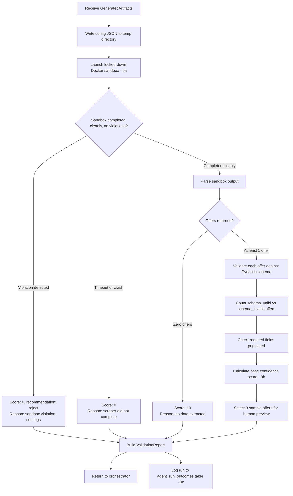

> **Fix from v2 [v3]:** Zero offers now correctly shows `Score: 10` (matching the formula in §9b), not `Score: 20`.

### 9b. Confidence Scoring Rules

```
Base score calculation:
  offers_extracted >= 5    -> start at 70
  offers_extracted >= 1    -> start at 50
  offers_extracted == 0    -> start at 10

  schema_valid_pct == 100% -> +20
  schema_valid_pct >= 80%  -> +10
  schema_valid_pct < 80%   -> +0

  title populated on all   -> +5
  category populated >= 80%-> +5
  discount populated >= 50%-> +5

  anti_bot_risk == "high"  -> -20
  anti_bot_risk == "medium"-> -5

  sandbox_violation present -> force score = 0, recommendation = reject   [v2]

Final thresholds:
  Score >= 90  -> AUTO-APPROVE
  Score 70-89  -> HUMAN REVIEW REQUIRED
  Score < 70   -> REJECT - manual work needed
```

`score_breakdown` (each contributing term above, itemized) is stored on `ValidationReport` and shown in the review UI, not just the final number.

### 9c. Outcome Logging — table created now, calibration analysis deferred [v3]

Every validation run — and every subsequent daily health check on that same target — writes a row to a new table:

```sql
-- Alembic migration
CREATE TABLE agent_run_outcomes (
    id               SERIAL PRIMARY KEY,
    brand            VARCHAR(255),
    run_type         VARCHAR(20),      -- 'initial_validation' | 'health_check'
    confidence_score INTEGER,
    score_breakdown  JSONB,
    recommendation   VARCHAR(20),
    offers_extracted INTEGER,
    was_auto_approved BOOLEAN,
    days_since_registration INTEGER,
    still_healthy_at_check  BOOLEAN,   -- filled in by later health checks, NULL until then
    checked_at       TIMESTAMP DEFAULT NOW()
);
```

> **[v3] Calibration script deferred.** The monthly calibration analysis (computing % of auto-approvals still healthy at 30 days) will be built as a fast-follow once there are 30+ days of production data. The table and logging are built now so data collection starts immediately.

---

## 10. LangGraph Orchestration

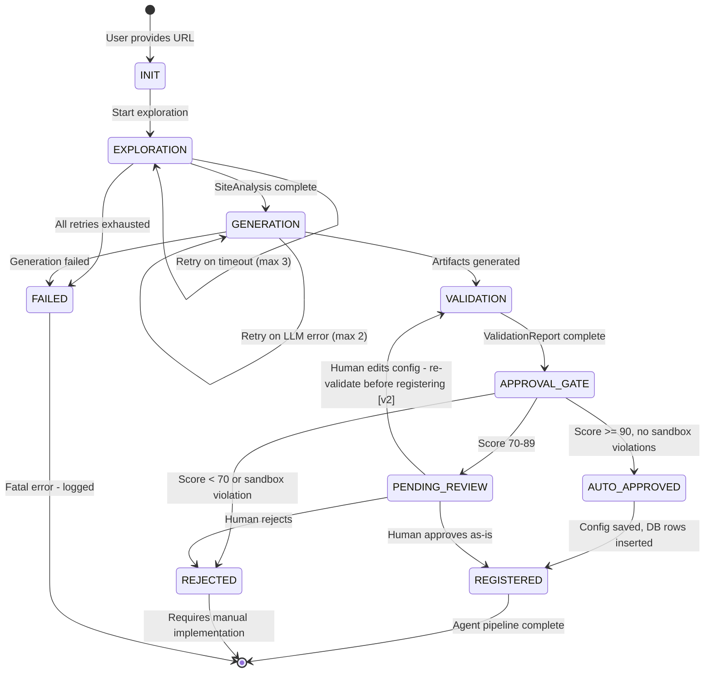

> **[v3] Repair states removed from the orchestrator state machine.** Health check detection is a standalone script. Automated repair will be added as a fast-follow (re-enters at VALIDATION).

### Orchestrator Code Structure

```python
# agent/orchestrator.py

from langgraph.graph import StateGraph, END
from agent.models import AgentState

def build_agent_graph() -> StateGraph:
    graph = StateGraph(AgentState)

    graph.add_node("exploration",       run_exploration_agent)
    graph.add_node("generation",        run_generation_agent)
    graph.add_node("validation",        run_validation_agent)          # sandboxed, 9a
    graph.add_node("registration",      run_registration)              # DB-driven, 12a

    graph.set_entry_point("exploration")

    graph.add_edge("exploration", "generation")
    graph.add_edge("generation",  "validation")

    graph.add_conditional_edges(
        "validation",
        route_after_validation,
        {
            "auto_approve": "registration",
            "pending":      END,   # Streamlit UI handles human review
            "reject":       END,
        }
    )

    graph.add_edge("registration", END)
    return graph.compile()

def route_after_validation(state: AgentState) -> str:
    if state.validation_report.sandbox_violations:      # [v2] hard stop
        return "reject"
    score = state.validation_report.confidence_score
    if score >= 90:
        return "auto_approve"
    elif score >= 70:
        return "pending"
    else:
        return "reject"
```

---

## 11. Human Approval Interface

### 11a. Access Control — lightweight for solo operator [v3]

**v2 designed** a two-role RBAC system (OPERATOR / APPROVER). Since this is initially a single-person operation, v3 simplifies:

```python
# auth/approval_rbac.py

from enum import Enum

class AgentRole(str, Enum):
    AGENT_USER = "agent_user"    # can trigger runs AND approve scrapers

# Hooks ready for future role split:
# OPERATOR = "operator"    # trigger only
# APPROVER = "approver"    # approve only

def require_role(user_id: str, role: AgentRole):
    """Placeholder — currently all authenticated users have AGENT_USER.
    When team grows, replace with real role lookup from DB or SSO."""
    # For now, any identified user passes
    return True

def get_current_user() -> str:
    """Returns current user identity. Placeholder for SSO integration."""
    import os
    return os.getenv("AGENT_USER_ID", "default_operator")
```

> **[v3]:** Hooks are in place so role enforcement can be enabled later without restructuring. The audit log still records who did what:

### Audit Log Table [v3]

```sql
-- Alembic migration
CREATE TABLE agent_audit_log (
    id          SERIAL PRIMARY KEY,
    brand       VARCHAR(255) NOT NULL,
    user_id     VARCHAR(255) NOT NULL,
    action      VARCHAR(50) NOT NULL,     -- 'trigger_run' | 'approve' | 'reject' | 'edit_config'
    details     JSONB,                     -- optional: config diff, rejection reason, etc.
    created_at  TIMESTAMP DEFAULT NOW()
);
```

### 11b. Edit-Then-Revalidate — closes the bypass gap [v2]

**v2 fix (unchanged):** the state machine in §10 makes this explicit — `PENDING_REVIEW --> VALIDATION` on edit, not `PENDING_REVIEW --> REGISTERED`. Concretely:

```python
# Streamlit callback, simplified
if st.button("Save Edited Config"):
    edited_config = parse_editor_input()
    new_state = AgentState(
        url=state.url,
        brand=state.brand,
        generated_artifacts=GeneratedArtifacts(config_json=edited_config, ...),
        is_repair_run=False,
    )
    # Re-enter the graph at validation, not registration
    result = agent_graph.invoke(new_state, start_at="validation")
    st.session_state["latest_validation"] = result.validation_report
```

An edited config is just a new candidate — it has to earn its score like anything else.

### Workflow

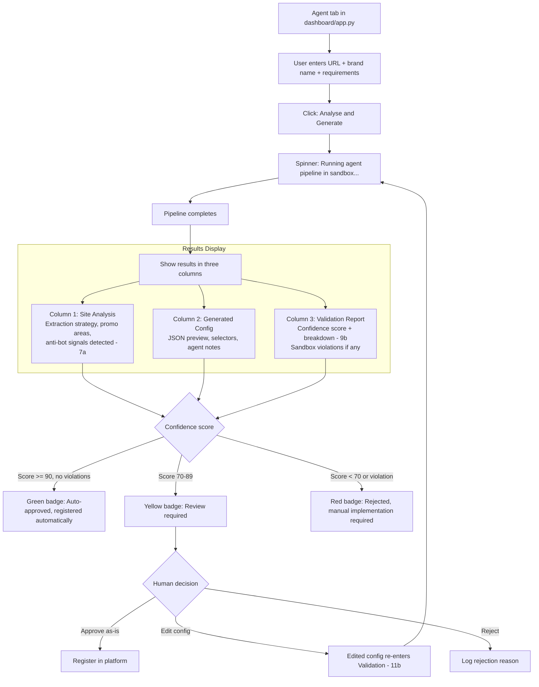

---

## 12. Registration Flow

### 12a. Data-Driven Registration — replaces filesystem-glob [v2, corrected v3]

Registration is explicitly data-driven. Prefect's source code is never edited. Instead:

```sql
-- Alembic migration
CREATE TABLE prefect_target_registry (
    id               SERIAL PRIMARY KEY,
    brand            VARCHAR(255) UNIQUE,
    config_path      VARCHAR(500),
    enabled          BOOLEAN DEFAULT TRUE,
    registered_at    TIMESTAMP DEFAULT NOW(),
    registered_by    VARCHAR(255)   -- user_id from the audit log
);
```

```python
# scripts/run_hybrid_promo_scraper.py — updated load_targets() [v3]

def load_targets(target_path: str | None = None) -> list[dict]:
    """Load targets from DB registry, falling back to filesystem glob."""
    if target_path:
        cfg = _load_target_file(target_path)
        return [cfg] if cfg else []

    # Try DB registry first (agent-registered targets)
    try:
        session = get_session()
        rows = session.query(PrefectTargetRegistry).filter_by(enabled=True).all()
        if rows:
            targets = []
            for row in rows:
                cfg = _load_target_file(row.config_path)
                if cfg:
                    targets.append(cfg)
            session.close()
            if targets:
                # Also load any filesystem-only configs not in the registry
                fs_targets = _load_filesystem_targets()
                registered_brands = {t["brand"] for t in targets}
                for t in fs_targets:
                    if t["brand"] not in registered_brands:
                        targets.append(t)
                return targets
    except Exception:
        pass  # Fall back to filesystem

    return _load_filesystem_targets()

def _load_filesystem_targets() -> list[dict]:
    """Original glob-based loading — backward compatible."""
    targets = []
    for config_file in sorted(glob.glob(os.path.join(CONFIG_DIR, "*.json"))):
        cfg = _load_target_file(config_file)
        if cfg:
            targets.append(cfg)
    return targets
```

> **[v3] Key change:** `load_targets()` in `scripts/run_hybrid_promo_scraper.py` is updated to read from the DB registry first, with filesystem fallback for backward compatibility. `flows/master_pipeline.py` continues to call `load_targets()` unchanged — it automatically picks up the new behavior.

### competitors Table — New Columns [v3]

```sql
-- Alembic migration
-- NOTE: The actual table is `competitors`, not `scraping_sources` as v2 stated.
ALTER TABLE competitors
ADD COLUMN extraction_strategy VARCHAR(20)  DEFAULT 'hybrid',
ADD COLUMN agent_generated     BOOLEAN      DEFAULT FALSE,
ADD COLUMN agent_confidence    INTEGER,
ADD COLUMN agent_notes         TEXT,
ADD COLUMN source_url          TEXT;
```

### Registration Sequence

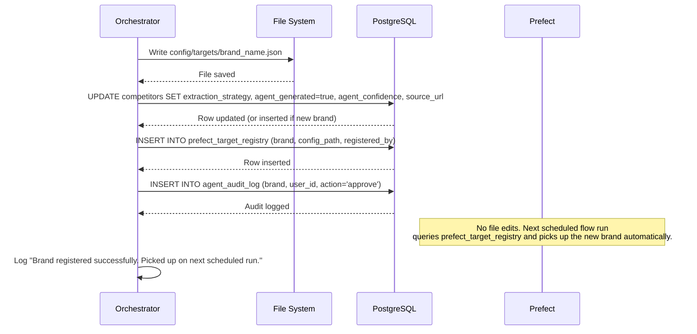

> **Atomicity:** all DB operations (competitor update, registry insert, audit log) run in a single transaction. If the config file write fails first, nothing is committed. If a DB insert fails, the config file is deleted. See §15 error handling.

---

## 13. End-to-End Data Flow

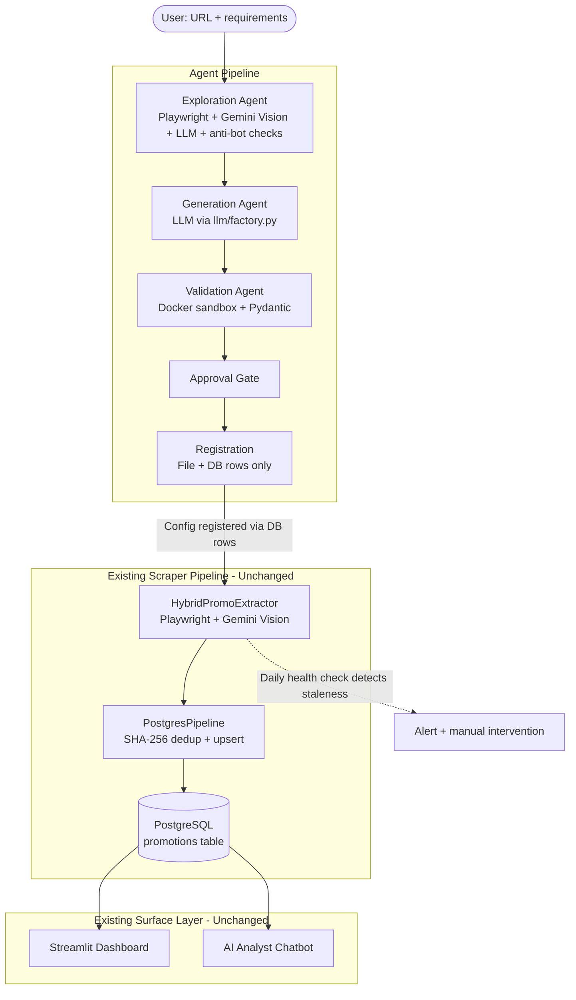

---

## 14. Prompts Catalogue — `agent/prompts.py`

| Prompt Name | Used By | Purpose |
| --- | --- | --- |
| `EXPLORATION_VISUAL_PROMPT` | Exploration Agent | Gemini Vision analyzes screenshots to find promotional areas (see §7) |
| `DOM_ANALYSIS_PROMPT` | Exploration Agent | LLM identifies CSS selectors from DOM HTML (see §7) |
| `CONFIG_GENERATION_PROMPT` | Generation Agent | LLM writes config JSON matching HybridPromoExtractor's interface (see §8) |
| `CUSTOM_SCRAPER_PROMPT` | Generation Agent | LLM writes custom scraper code for non-standard sites |
| `TEST_ASSERTION_PROMPT` | Generation Agent | LLM writes test assertions for the generated config |

> **[v3]:** `REPAIR_DIFF_PROMPT` deferred with the repair agent. All prompt text is now inlined in the relevant sections above (§7, §8) rather than pointing to a missing Appendix A.

---

## 15. Error Handling

| Failure Mode | Agent | Handling |
| --- | --- | --- |
| Site unreachable or 403 | Exploration | Retry 3x with 10s delay. If all fail: set anti_bot_risk based on 7a checks, confidence=0, return partial analysis |
| Playwright timeout | Exploration | Retry with longer timeout (45s). Log warning. |
| Gemini Vision API error | Exploration | Fall back to DOM-only analysis. Deduct 15 from confidence. |
| LLM API error | Generation | Retry 2x with exponential backoff (uses existing `tenacity` config). If all fail: status=FAILED |
| Generated config is invalid JSON | Generation | LLM asked to self-correct with error message. Max 1 retry. |
| **Sandbox violation (network/fs/resource) [v2]** | **Validation** | **Force confidence=0, recommendation=reject, log violation detail — never overridable by offer count** |
| Scraper returns zero offers | Validation | Set confidence=10, flag as "no data extracted" |
| Gemini rate limit 429 | Exploration, Validation | Exponential backoff via tenacity: 4s, 8s, 16s (existing pattern from `hybrid_promo_extractor.py`) |
| DB insert fails at registration | Registration | Rollback entire transaction, delete config file if written, log error |
| **Health check finds 0 offers on a live scraper** | **Monitor** | **Log to agent_run_outcomes, alert via logging. Automated repair deferred [v3]** |
| **Edited config fails re-validation [v2]** | **Approval** | **Block registration, show reviewer the new ValidationReport, require another decision** |

---

## 16. Phased Implementation Plan

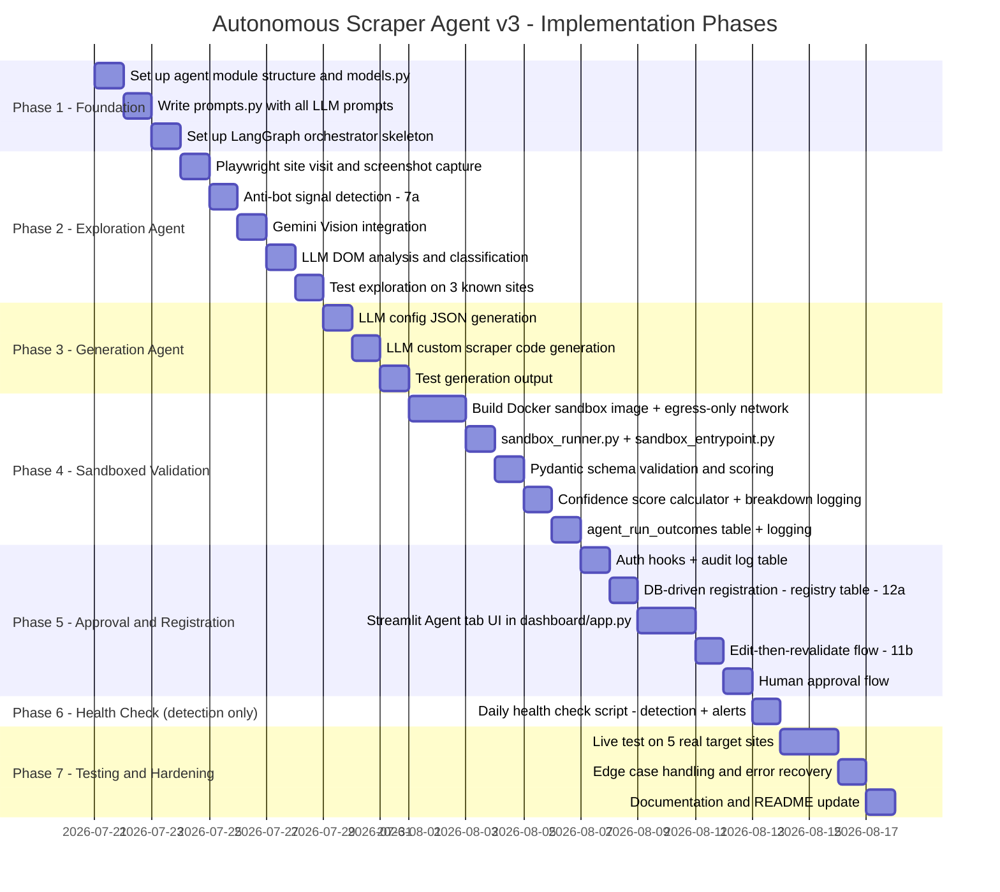

**Total: ~4 weeks** (reduced from 5 in v2 by deferring repair agent and calibration script).

---

## 17. CLI Interface — `scripts/run_scraper_agent.py` [v3]

```python
# scripts/run_scraper_agent.py

"""
CLI entry point for the scraper agent.

Usage:
    # Run full agent pipeline for a new site
    python scripts/run_scraper_agent.py --url "https://www.example.com/sale" --brand "Example Brand"

    # With custom requirements
    python scripts/run_scraper_agent.py --url "https://www.example.com/sale" --brand "Example Brand" \
        --requirements "Focus on clothing and shoes promotions only"

    # Dry run — explore + generate + validate, but do NOT register even if auto-approved
    python scripts/run_scraper_agent.py --url "https://www.example.com/sale" --brand "Example Brand" --dry-run
"""

import argparse

def main():
    parser = argparse.ArgumentParser(description="Run the autonomous scraper agent.")
    parser.add_argument("--url", required=True, help="Target website URL to analyse and scrape")
    parser.add_argument("--brand", required=True, help="Brand name for this competitor")
    parser.add_argument("--requirements", default="", help="Business rules — what to extract")
    parser.add_argument("--dry-run", action="store_true", help="Run pipeline but skip registration")
    args = parser.parse_args()

    from agent.orchestrator import build_agent_graph
    from agent.models import AgentState

    state = AgentState(url=args.url, brand=args.brand, requirements=args.requirements)
    graph = build_agent_graph()
    result = graph.invoke(state)

    # Print results
    print(f"Status: {result.status}")
    if result.validation_report:
        print(f"Confidence: {result.validation_report.confidence_score}")
        print(f"Recommendation: {result.validation_report.recommendation}")

if __name__ == "__main__":
    main()
```

---

## 18. Scalability Considerations

| Concern | Current Design | Ceiling | Fix When Needed |
| --- | --- | --- | --- |
| Concurrent agent runs | Single-threaded, one at a time | 1 simultaneous run | Add a task queue (Celery or Prefect task) if volume justifies it |
| LLM API rate limits | Uses existing tenacity backoff from `hybrid_promo_extractor.py` | Provider-dependent | Adjust `VISION_API_MIN_DELAY` env var |
| Sandbox container startup | One container per validation run | ~1-2s cold start per run | Keep a small warm pool if validation volume grows past ~50/day |
| Config file count | One JSON file per competitor | ~1000 files before glob becomes slow | Already addressed by DB registry migration |

---

## 19. Known Limitations and Mitigations

### 19a. Selector Staleness — detection now, repair deferred [v3]

**v2 planned** a full repair loop (automatic re-exploration + config patching). **v3 ships detection only:**

```python
# scripts/run_health_check.py

def daily_health_check():
    for target in get_active_targets():
        recent_runs = get_last_n_runs(target.brand, n=3)
        if all(run.offers_extracted == 0 for run in recent_runs):
            log_outcome(target.brand, run_type="health_check", still_healthy_at_check=False)
            logger.warning("STALE SELECTORS DETECTED for %s — manual intervention required", target.brand)
            # TODO [fast-follow]: trigger_repair_agent(target.brand, target.url)
        else:
            log_outcome(target.brand, run_type="health_check", still_healthy_at_check=True)
```

> **Fast-follow plan:** Once the core pipeline is validated in production (2+ weeks), add `agent/repair_agent.py` that re-runs exploration, diffs old vs new selectors, and produces a patched config routed back through validation. The health check already logs the data needed to trigger this.

### Remaining Limitations

| Limitation | Impact | Mitigation |
| --- | --- | --- |
| Agent cannot bypass sophisticated anti-bot systems (Cloudflare Enterprise, Akamai) | High-risk sites may return 0 offers | 7a's concrete signal list flags these early and explains why |
| LLM may hallucinate CSS selectors that do not exist | Validation catches this - scraper returns 0 | Confidence score drops below 70, triggers rejection |
| Image-based sites require Gemini Vision for both exploration and extraction | 2x API cost per site | Still under $0.01 per full site analysis at current pricing |
| Agent cannot handle CAPTCHA or login-gated content | Some sale pages require login | Out of scope - flagged by 7a's `captcha_present` check, documented as known limitation |

---

## 20. Success Criteria

```
Phase 1-3 (Generation):
  Agent correctly classifies extraction strategy for 80% of test sites
  Generated config JSON is valid and parses without errors
  Generated selectors match actual DOM elements on the target site
  Generated config is accepted by HybridPromoExtractor without modification

Phase 4 (Sandboxed Validation):
  Sandboxed scraper completes without crash or violation for 80% of generated configs
  Zero sandbox violations go unflagged (100% detection in test suite)
  Confidence scoring correctly identifies working vs broken scrapers
  ValidationReport contains at least 3 sample offers for human review

Phase 5 (Approval and Registration):
  Edited configs cannot reach registration without passing re-validation
  Registration is a pure DB/file write - zero Prefect source edits
  Audit log records every trigger, approval, and rejection

Phase 6 (Health Check):
  Health check correctly identifies stale selectors within 24 hours

Phase 7 (Full Pipeline):
  End-to-end: URL in -> scraper registered -> offers in DB
  Running agent twice for the same site produces zero new DB inserts (dedup works)
  Adding a new brand requires zero code changes - only agent invocation
  Human approval flow works: approve routes to registration, reject logs reason
```

---

## 21. Design Principles

1. **The existing pipeline is never modified.** `HybridPromoExtractor`, the Prefect flow's *logic*, and `database/connection.py` are unchanged. Prefect now reads an explicit DB registry rather than having its source file edited — this is a stricter version of the same principle, not a violation of it. `load_targets()` gains DB-first loading with filesystem fallback.
2. **All LLM prompts live in `agent/prompts.py`.**
3. **The human approval gate is not optional, and neither is re-validation after an edit.** Every registration is auditable — every edited config must re-earn its score before it can be registered.
4. **Validation runs the actual scraper, not a simulation — inside a sandbox that limits what "actual" is allowed to touch.** The confidence score is based on real data extracted from the real site, under constraints that prevent a misbehaving script from affecting anything outside its own run.
5. **Failure is a first-class outcome.** A score of 0 with a clear reason is a good output. Detection of staleness is immediate; automated repair comes as a fast-follow.
6. **Log early, analyze later.** Every validation logs its score and outcome to `agent_run_outcomes`. Calibration analysis will be built when there's enough data to be meaningful.

---

## Appendix A — Deferred Items (Fast-Follow)

These items are designed but deferred from the initial release. They will be built once the core pipeline has 2+ weeks of production data:

| Item | Plan Section | Trigger to Build |
| --- | --- | --- |
| Repair Agent (`agent/repair_agent.py`) | §19a | First instance of selector staleness detected by health check |
| `REPAIR_DIFF_PROMPT` | §14 | Built alongside repair agent |
| Calibration script | §9c | 30+ days of `agent_run_outcomes` data accumulated |
| RBAC role split (OPERATOR / APPROVER) | §11a | Team grows beyond 1 person, or system moves toward production |
| `--repair` CLI flag | §17 | Repair agent is implemented |
